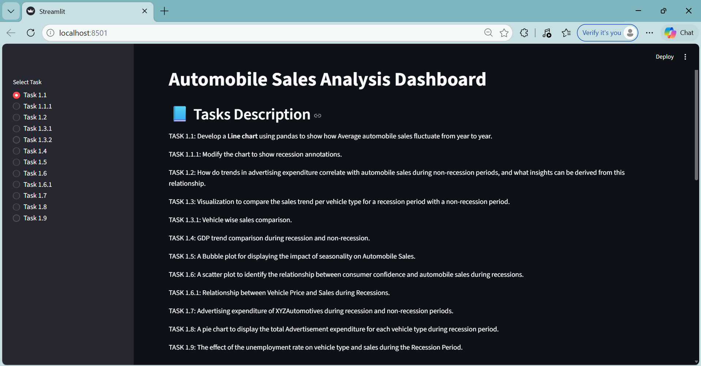
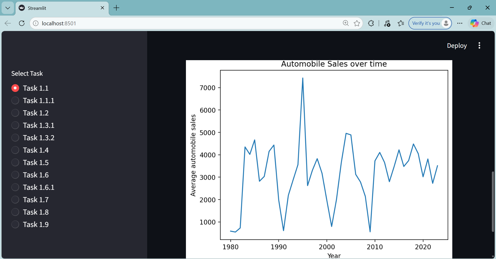

# Automobile Sales Analysis Dashboard

An interactive data analysis dashboard built using **Python, Pandas, Seaborn, Matplotlib and Streamlit** to analyze automobile sales trends during recession and non-recession periods.

---

## Project Overview

This project focuses on analyzing historical automobile sales data to understand:

* Sales fluctuations over different years
* Impact of recession on automobile sales
* Relationship between advertising expenditure and sales
* Effect of consumer confidence, unemployment rate and vehicle prices
* Seasonal trends in automobile sales

The dashboard allows users to **interactively select different analysis tasks and visualize insights through multiple plots.**

---

## Features

* Interactive Streamlit dashboard
* 12 different data visualizations
* Recession vs Non-Recession comparative analysis
* Vehicle type based insights
* Economic indicator impact analysis
* Clean and structured data storytelling

---

## Tech Stack

* Python
* Pandas
* Matplotlib
* Seaborn
* Streamlit
* Requests

---

## How to Run the Project

1. Clone the repository

```
git clone https://github.com/your-username/Automobile-Sales-Dashboard.git
```

2. Navigate into the project folder

```
cd Automobile-Sales-Dashboard
```

3. Install dependencies

```
pip install -r requirements.txt
```

4. Run the Streamlit app

```
streamlit run app.py
```

---

## Dashboard Screenshots

### Task Selection Interface



### Plot Visualization



## Future Improvements

* Add year range filters
* Add KPI summary cards
* Improve UI layout and responsiveness
* Deploy dashboard on Streamlit Cloud
* Add geographical sales visualization
Will do it as I learn new things 
---

## Dataset Source

IBM Data Analysis Course Dataset (Public URL)

---

## Author

Lakshay Sharma
B.Tech Student | Aspiring Data Scientist / ML Engineer
